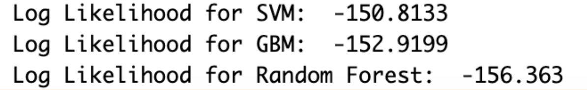
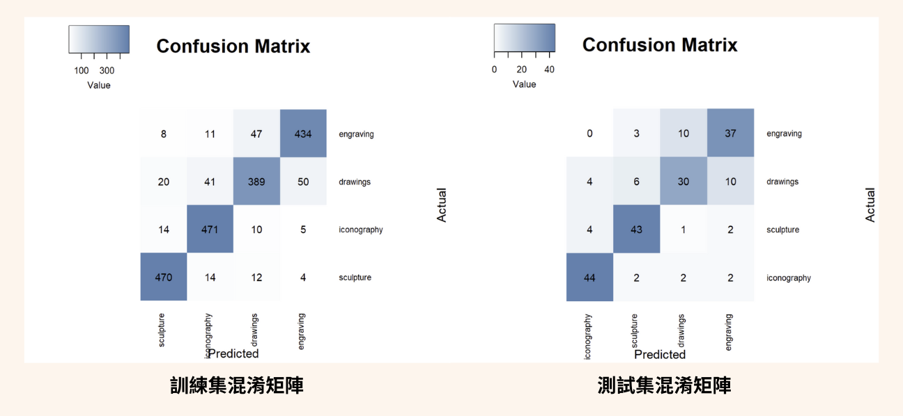

# [Group3] 藝術風格探索:利用特徵提取與機器學習進行圖像分類
The goals of this project.
- Topic 1: 圖像分類的耗時
- Topic 2: 深度學習的限制與挑戰

## Contributors
|組員|系級|學號|工作分配|
|-|-|-|-|
|高崇哲|統計碩一|112354020|團隊規劃、資料前處理、特徵工程、模型訓練|
|林青欣|教育碩一|112152012|| 
|黃翊瑄|資科碩一|112753108||
|陳彥竹|資管大四|109306094|模型訓練、簡報製作、Github製作|
|李佳芬|資科碩一|112753103||
|鄭家晏|資科大四|109703067||

## Quick start
Please provide an example command or a few commands to reproduce your analysis, such as the following R script:
```R
Rscript code/your_script.R --input data/training --output results/performance.csv
```

## Folder organization and its related description
idea by Noble WS (2009) [A Quick Guide to Organizing Computational Biology Projects.](https://journals.plos.org/ploscompbiol/article?id=10.1371/journal.pcbi.1000424) PLoS Comput Biol 5(7): e1000424.

### docs
* project.pdf: presentation的簡報檔
* poster.pdf: 海報展演所製作的海報

### data
* Input
  * Source: https://www.kaggle.com/datasets/thedownhill/art-images-drawings-painting-sculpture-engraving
  * Format: jpeg、jpg、png格式之圖片
  * Size: 約有9000張圖片

* 本研究使用之資料
  * train: 共有2000張jpeg格式之圖片，drawings/painting/icongraphy/sculpture四個種類各500張
  * test: 共有200張jpeg格式之圖片，drawings/painting/icongraphy/sculpture四個種類各50張


### code
資料預處理:<br>
(1) 圖片篩選：由於此資料集含有jpeg、jpg、png的圖片，為了統一格式，採用數量最多的 jpeg 格式，<br>
             但painting無jpeg格式的圖片，因此將此類別去除，取其餘四個類別之圖片<br>
(2) 手動刪除不合適之資料（例如：多張圖片集於一張、不屬於該類別<br>
(3) 隨機將各類別之訓練集調整至500張、測試集調整至50張<br>
(4) 裁切圖片：將所有圖片resize至128*128<br>

特徵提取
由於本研究所使用之資料集為圖片資料，因此需自行對圖像做特徵提取。以下是本研究所提取之特徵：

|特徵類型|特徵數|特徵名稱|
|-|-|-|
|顏色|9|RGB平均數(Mean)、RGB變異數(Variance)、RGB一階差分值(Diff)|| 
|結構|3|分層結構(Layers)、對稱性(Symmetry)、對齊度(Alignment)||
|紋理|4|對比度(Contrast)、能量(Energy)、同質性(Homogeneity)、異質性(Dissimilarity)||
|形狀|6|面積(Area)、重心(Centroid[X,Y])、凸包面積(Convex Hull Area)、方向(Orientation)、圓度(Circularity)||

特徵選取<br>
在紋理特徵中，從公式可以得知對比度為異質性的平方，因此將異質性欄位刪除。此外，也將所有特徵做<br>
正規化後，透過EDA觀察所有特徵的關係與分布，無發現任何異樣，因此保留其餘所有特徵。<br>

使用套件<br>
e1071、jpeg、ROCR、caret、imager、gplots、readxl、ggplot2、reshape2、readbitmap

### results
* Accuracy 比較：
  * 不用過多特徵即可達到不錯效果
  * 5個特徵的SVM表現最好，但在21個特徵表現較差，推測因為SVM過擬合，導致效果較差

| 特徵數 | SVM  | Random Forest | GBM  |
| ------ | ---- | ------------- | ---- |
| RGB平均數、變異數 | 6    | 0.61          | 0.605 |
| RGB平均數、變異數、一階差分值 | 9    | 0.705         | 0.685 |
| RGB平均數、變異數、一階差分值、結構特徵值 | 12   | 0.75          | <span style="color:red">0.715</span> |
| RGB平均數、變異數、一階差分值、結構特徵值、紋理特徵值 | 15   | <span style="color:red">0.77</span> | 0.69  |
| RGB平均數、變異數、一階差分值、結構特徵值、紋理特徵值、形狀特徵值 | 21   | 0.59          | <span style="color:red">0.7</span>  | 0.69  |

* 模型選擇：<br>
 我們使用Loglikelihood幫助我們比較各個模型



* 最佳模型的混淆矩陣
 


* Is the improvement significant?

## References
* Packages you use : e1071、jpeg、ROCR、caret、imager、gplots、readxl、ggplot2、reshape2、readbitmap
* Related publications
